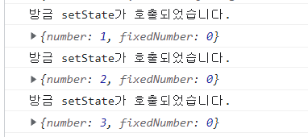

# 컴포넌트

[TOC]

---

✔ `props` : 컴포넌트의 속성 값

✔ `state` : 컴포넌트의 상태 값

## 클래스형 컴포넌트

```react
// App.js

import "./App.css";

function App() {
  const name = "리액트";
  return <div className="react">{name}</div>;
}

export default App;
```

> 함수 컴포넌트

```react
// App.js

import "./App.css";
import { Component } from 'react';

class App extends Component {
  render() {
    const name = 'react';
    return <div className="react">{name}</div>;
  }
}

export default App;
```

> 클래스형 컴포넌트

- 클래스형 컴포넌트와 함수 컴포넌트의 차이점
  - 클래스형 컴포넌트 :
    - state 기능 및 라이프 사이클 기능을 사용할 수 있음
    - 임의 메서드 정의 가능
    - **render 함수**가 꼭 있어야 하고, 그 안에서 보여주어야 할 JSX 를 반환해야 함.
  - 함수 컴포넌트 :
    - 클래스형 컴포넌트보다 선언하기 쉬움
    - 메모리 자원 사용이 적음
    - state 와 라이프사이클 API의 사용이 불가능함 >> 이후 Hooks 기능 도입으로 해결

---

## 첫번째 컴포넌트 생성

1. 파일 만들기
2. 코드 작성하기
3. 모듈 내보내기 및 불러오기

### 01. src 디렉터리에 MyComponent.js 파일 생성

### 02. 코드 작성

```react
const MyComponent = () => {
    return <div>나의 새롭고 멋진 컴포넌트</div>;
}

export default MyComponent;
```

- **화살표 함수 (arrow function)**
  
  ```js
  // 기존 함수
  setTimeout(function() {
      console.log('hello world');
  }, 1000);
  ```
  
  ```react
  // 화살표 함수
  setTimeout(() => {
  	console.log('hello world');
  }, 1000);
  ```
  
  

```react
// 1

function BlackDog() {
    this.name = '흰둥이';
    return {
        name: '검둥이',
        bark: function() {
            console.log(this.name + ':멍멍!');
        }
    }
}

const blackDog = new BlackDog();
blackDog.bark();   // 검둥이:멍멍!
```

```react
// 2

function WhiteDog() {
    this.name = '흰둥이';
    return {
        name: '검둥이',
        bark: () => {
            console.log(this.name + ':멍멍!');
        }
    }
}

const whiteDog = new WhiteDog();
whiteDog.bark();   // 흰둥이:멍멍!
```

> function() 을 사용했을 때는 검둥이, () => 를 사용했을 때는 흰둥이가 나타남.
> 
> 일반 함수는 자신이 종속된 객체를 this로 가리키며, 화살표 함수는 자신이 종속된 인스턴스를 가리킴.

😉 **Reactjs Code Snippets 사용하기**

- `rsc + <Enter>` : 컴포넌트 함수 생성
- `rcc + <Enter>` : 클래스형 함수 생성

### 03. 모듈 내보내기 및 불러오기

💡 **모듈 내보내기 (export)**

```react
// MyComponent.js

export default MyComponent;
```

> 다른 파일에서 이 파일을 import할 때, 위에서 선언한 MyComponent 클래스를 불러오도록 설정

💡 **모듈 불러오기 (import)**

```react
// App.js

import MyComponent from './MyComponent';

const App = () => {
    return <MyComponent/>
};

export default App;
```

---

## props

✔ **props** : properties를 줄인 표현. 컴포넌트 속성을 설정할 때 사용하는 요소


- props는 컴포넌트가 사용되는 과정에서 부모컴포넌트가 설정하는 값 (컴포넌트는 props를 읽기만 가능)
- props는 부모 컴포넌트에서 변경해야 함.


### 01. JSX 내부에서 props 렌더링

- props 값은 컴포넌트 함수의 파라미터로 받아 와서 사용 가능

```react
// MyComponent.js

const MyComponent = props => {
    return <div>안녕하세요, 제 이름은 {props.name}입니다.</div>;
};

export default MyComponent;
```

### 02. 컴포넌트를 사용할 때 props 값 지정하기

- App 컴포넌트에서 MyComponent의 props 값을 지정

```react
// App.js

import MyComponent from "./MyComponent";

const App = () => {
  return <MyComponent name="react" />
};

export default App;
```

### 03. props 기본값 설정 : defaultProps

```react
// App.js

import MyComponent from "./MyComponent";

const App = () => {
  return <MyComponent />;
};

export default App;
```

> name 이 설정되지 않은 상태

```react
// MyComponent.js

const MyComponent = props => {
    return <div>안녕하세요, 제 이름은 {props.name}입니다.</div>;
};

MyComponent.defaultProps = {
    name: '기본이름'
};

export default MyComponent;
```

### 04. 태그 사이의 내용을 보여 주는 children

- 리액트 컴포넌트를 사용할 때, 태그 사이의 내용을 보여 주는 props = `children`

```react
// App.js

import MyComponent from "./MyComponent";

const App = () => {
  return <MyComponent>리액트</MyComponent>;
};

export default App;
```

> MyComponent 태그 사이에 작성한 문자열을 MyComponent 내부에 보여주려면 `props.children` 값을 보여 주어야 함.

```react
// MyComponent.js

const MyComponent = props => {
    return (
        <div>
            안녕하세요, 제 이름은 {props.name}입니다.<br/>
            children 값은 {props.children}입니다.
        </div>
    );
};

MyComponent.defaultProps = {
    name: '기본이름'
};

export default MyComponent;
```

### 05. 비구조화 할당 문법을 통해 props 내부 값 추출하기

- ES6의 비구조화 할당 문법을 사용하여 내부 값을 바로 추출하는 방법`

```js
// MyComponent.js


const MyComponent = props => {
    const { name, children } = props;
    return (
        <div>
            안녕하세요, 제 이름은 {name}입니다.<br/>
            children 값은 {children}입니다.
        </div>
    );
};

MyComponent.defaultProps = {
    name: '기본이름'
};

export default MyComponent;
```

✔ **비구조화 할당 (=구조 분해 문법)** : 객체에서 값을 추출하는 문법

```js
// MyComponent.js


const MyComponent = ({ name, children }) => {
    return (
        <div>
            안녕하세요, 제 이름은 {name}입니다.<br/>
            children 값은 {children}입니다.
        </div>
    );
};

MyComponent.defaultProps = {
    name: '기본이름'
};

export default MyComponent;
```

### 06. propTypes를 통한 props 검증

- propTypes : 컴포넌트의 필수 props를 지정하거나 props 타입을 지정할 때 사용

```js
// MyComponent.js


import PropTypes from 'prop-types';

const MyComponent = ({ name, children }) => {
    return (
        <div>
            안녕하세요, 제 이름은 {name}입니다.<br/>
            children 값은 {children}입니다.
        </div>
    );
};

MyComponent.defaultProps = {
    name:
 '기본 이름'
};

// props 타입 지정
MyComponent.propTypes = {
    name: PropTypes.string
};

export default MyComponent;
```

> name 값은 무조건 문자열(string) 형태로 전달해야 함

```js
import MyComponent from "./MyComponent";

const App = () => {
  return <MyComponent name={3}>리액트</MyComponent>;
};

export default App;
```

> 실제 브라우저에서 name이 3 으로 표시되지만, 설정한 props가 propTypes에서 지정한 형태와 일치하지 않기 때문에 개발자도구의 console에서 prop type이 다르다는 경고 메시지가 나온다.

```js
import MyComponent from "./MyComponent";

const App = () => {
  return <MyComponent name="React">리액트</MyComponent>;
};

export default App;
```


#### 06-1. isRequired를 사용하여 필수 propTypes 설정

- propTypes를 지정하지 않았을 때, 경고 메시지를 띄워주는 작업

```react
// MyComponent.js

import PropTypes from 'prop-types';

const MyComponent = ({ name, favoriteNumber, children }) => {
    return (
        <div>
            안녕하세요, 제 이름은 {name}입니다.<br/>
            children 값은 {children}입니다.<br/>
            좋아하는 숫자는 {favoriteNumber}입니다.
        </div>
    );
};

MyComponent.defaultProps = {
    name: '기본 이름'
};

MyComponent.propTypes = {
    name: PropTypes.string,
    favoriteNumber: PropTypes.number.isRequired
};

export default MyComponent;
```

> Warning: Failed prop type: Invalid prop `name` of type `number` supplied to `MyComponent`, expected `string`.
>
> = favoriteNumber 를 설정하지 않았기 때문에

```react
// App.js

import MyComponent from "./MyComponent";

const App = () => {
  return (
    <MyComponent name="react" favoriteNumber={7}>
      리액트
    </MyComponent>
  );
};

export default App;
```


#### 06-2. 더 많은 propTypes 종류

- `array` : 배열

- `arrayOf` (다른 PropType) : 특정 PropType으로 이루어진 배열

  ```
  ex) arrayOf(PropTypes.number) : 숫자로 이루어진 배열
  ```

- `bool` : true / false 값

- `func` : 함수

- `number` : 숫자

- `object` : 객체

- `string` : 문자열

- `symbol` : ES6의 Symbol

- `node` : 렌더링할 수 있는 모든 것 (숫자, 문자열, 혹은 JSX 코드. children도 node PropType)

- `instanceOf(클래스)` : 특정 클래스의 인스턴스

- `oneOf(['dog', 'cat'])` : 주어진 배열 요소 중 값 하나

- `oneOfType([React.PropTypes.string, PropTypes.number])` : 주어진 배열 안의 종류 중 하나

- `objectOf(React.PropTypes.number)` : 객체의 모든 키 값이 인자로 주어진 PropType인 객체

- `shape({ name: PropTypes.string, num: PropTypes.number })` : 주어진 스키마를 가진 객체

- `any` : 아무 종류


### 07. 클래스형 컴포넌트에서 props 사용하기

- 클래스형 컴포넌트에서 props를 사용할 때는 render 함수에서 this.props를 조회
- defaultProps와 propTypes와 동일한 방식으로 설정

```react
// MyComponent.js

import {Component} from 'react';
import PropTypes from 'prop-types';


class MyComponent extends Component {
    render() {
        const {name, favoriteNumber, children } = this.props;  // 비구조화 할당
        return (
            <div>
                안녕하세요, 제 이름은 {name}입니다.<br/>
                children 값은 {children}입니다.<br/>
                좋아하는 숫자는 {favoriteNumber}입니다.
            </div>
        );
    }
}

MyComponent.defaultProps = {
    name: '기본 이름'
};

MyComponent.propTypes = {
    name: PropTypes.string,
    favoriteNumber: PropTypes.number.isRequired
};

export default MyComponent;
```

```react
// MyComponent.js

import {Component} from 'react';
import PropTypes from 'prop-types';

class MyComponent extends Component {

    static defaultProps = {
        name: '기본이름'
    };

    staticpropTypes = {
        name: PropTypes.string,
        favoriteNumber: PropTypes.number.isRequired
    }

    render() {
        const {name, favoriteNumber, children } = this.props;  // 비구조화 할당
        return (
            <div>
                안녕하세요, 제 이름은 {name}입니다.<br/>
                children 값은 {children}입니다.<br/>
                좋아하는 숫자는 {favoriteNumber}입니다.
            </div>
        );
    }
}

export default MyComponent;
```

> 클래스형 컴포넌트에서 defaultProps와 propTypes를 설정할 때, class 내부에서 지정하는 방법

-----------------------------------------


## state

✔ **state** : 컴포넌트 내부에서 바뀔 수 있는 값


### 01. 클래스형 컴포넌트의 state

```react
// Counter.js

import { Component } from "react";

class Counter extends Component {
    constructor(props) {
        super(props);

        // state의 초깃값 설정하기
        this.state = {
            number: 0
        };
    }

    render() {
        // state를 조회할 때는 this.state로 조회
        const { number } = this.state;

        return (
            <div>
                <h1>{number}</h1>
                <button
                    // onClick을 통해 버튼이 클릭되었을 때 호출할 함수를 지정
                    onClick={() => {
                        // this.setState를 사용하여 state에 새로운 값을 넣을 수 있음
                        this.setState({ number: number+1 });
                    }}
                >
                    +1
                </button>
            </div>
        );
    }
}

export default Counter;
```

- `super(props)` : 클래스형 컴포넌트에서 constructor를 작성할 때, 반드시 호출 ‼
  - 호출 시, 현재 클래스형 컴포넌트가 상속받고 있는 리액트의 Component 클래스가 지닌 생성자 함수 호출

```react
// App.js

import Counter from "./Counter";

const App = () => {
  return (
    <Counter/>
  );
};

export default App;
```


#### 01-1. state 객체 안에 여러 값이 있을 때

```react
// Counter.js

import { Component } from "react";

class Counter extends Component {
    constructor(props) {
        super(props);

        // state의 초깃값 설정하기
        this.state = {
            number: 0,
            fixedNumber: 0
        };
    }

    render() {
        // state를 조회할 때는 this.state로 조회
        const { number, fixedNumber } = this.state;

        return (
            <div>
                <h1>{number}</h1>
                <h2>바뀌지 않는 값: {fixedNumber}</h2>
                <button
                    // onClick을 통해 버튼이 클릭되었을 때 호출할 함수를 지정
                    onClick={() => {
                        // this.setState를 사용하여 state에 새로운 값을 넣을 수 있음
                        this.setState({ number: number+1 });
                    }}
                >
                    +1
                </button>
            </div>
        );
    }
}

export default Counter;
```

- `this.setState` : 인자로 전달된 객체 안에 들어있는 값만 바꾸어 줌


#### 01-2. state를 constructor에서 꺼내기

```react
// Counter.js

import { Component } from "react";

class Counter extends Component {
    state = {
        number: 0,
        fixedNumber: 0
    };

    render() {
        // state를 조회할 때는 this.state로 조회
        const { number, fixedNumber } = this.state;

        return (
            <div>
                <h1>{number}</h1>
                <h2>바뀌지 않는 값: {fixedNumber}</h2>
                <button
                    // onClick을 통해 버튼이 클릭되었을 때 호출할 함수를 지정
                    onClick={() => {
                        // this.setState를 사용하여 state에 새로운 값을 넣을 수 있음
                        this.setState({ number: number+1 });
                    }}
                >
                    +1
                </button>
            </div>
        );
    }
}

export default Counter;
```

> constructor 메서드를 선언하지 않고도 state 초깃값 설정 가능


#### 01-3. this.setState에 객체 대신 함수 인자 전달하기

- `this.setState` 를 사용하여  state 값을 업데이트할 때는 상태가 비동기적으로 업데이트 됨.

```react
// Counter.js - button onClick

onClick={() => {
    this.setState({ number: number+1 });
    this.setState({ number: this.state.number+1 });
}}
```

> onClick에 설정한 함수 내부에서 `this.setState`를 두번 호출하는 경우
>
> 결과 : 숫자가 1씩 더해짐
>
> => this.setState를 사용한다고해서 state 값이 바로 바뀌지는 않기 때문


```react
// Counter.js -button

<button
    // onClick을 통해 버튼이 클릭되었을 때 호출할 함수를 지정
    onClick={() => {
        this.setState(prevState => {
            return {
                number: prevState.number + 1
            };
        });

        this.setState(prevState => {
            return {
                number: prevState.number + 1
            };
        });
    }}
    >
    +1
</button>
```

> 결과 : 숫자가 2씩 더해짐
>
> prevState : 기존 상태
>
> props : 현재 지니고 있는 props


#### 01-4. this.setState가 끝난 후 특정 작업 실행하기

- setState의 두 번째 파라미터로 콜백함수를 등록하여 작업처리 가능

```react
// Counter.js - button

<button
    // onClick을 통해 버튼이 클릭되었을 때 호출할 함수를 지정
    onClick={() => {
        this.setState(
            {
                number: number+1
            },
            () => {
                console.log('방금 setState가 호출되었습니다.');
                console.log(this.state);
            }
        );
    }}
    >
    +1
</button>
```




### 02. 함수 컴포넌트에서 useState 사용하기


#### 02-1. 배열 비구조화 할당

- 배열 안에 들어 있는 값을 쉽게 추출할 수 있도록 해주는 문법

```react
const array = [1, 2];
const one = array[0];
const two = array[1];

---------------------------------
// 배열 비구조화 할당

const array = [1, 2];
const [one, two] = array;
```


#### 02-2. useState 사용하기

```react
// Say.js

import { useState } from "react";

const Say = () => {
    const [message, setMessage] = useState('');   // 상태의 초깃값
    const onClickEnter = () => setMessage('안녕하세요!');
    const onClickLeave = () => setMessage('안녕히 가세요!');

    return(
        <div>
            <button onClick={onClickEnter}>입장</button>
            <button onClick={onClickLeave}>퇴장</button>
            <h1>{message}</h1>
        </div>
    );
};

export default Say;
```

1. useState 함수의 인자에는 상태의 초깃값
   - 반드시 객체가 아니어도 됨. ( 숫자, 문자열, 객체, 배열 )
2. 함수 호출 시, 배열 반환
   - 첫번째 원소 : 현재 상태
   - 두번째 원소 : 상태를 바꾸어주는 함수 **( =세터 함수, Setter function )**


#### 02-3. 한 컴포넌트에서 useState 여러 번 사용하기

```react
// Say.js

import { useState } from "react";

const Say = () => {
    const [message, setMessage] = useState('');
    const onClickEnter = () => setMessage('안녕하세요!');
    const onClickLeave = () => setMessage('안녕히 가세요!');

    const [color, setColor] = useState('black');

    return(
        <div>
            <button onClick={onClickEnter}>입장</button>
            <button onClick={onClickLeave}>퇴장</button>
            <h1 style={{ color }}>{message}</h1>

            <button style={{ color: 'red' }} onClick={() => setColor('red')}>빨간색</button>
            <button style={{ color: 'green' }} onClick={() => setColor('green')}>초록색</button>
            <button style={{ color: 'blue' }} onClick={() => setColor('blue')}>파란색</button>
        </div>
    );
};

export default Say;
```


### 🌟 state를 사용할 때 주의 사항

- state 값을 바꾸어야할 때는 `setState` 혹은 `useState`를 통해 전달받은 세터 함수를 사용해야 함 !

- 배열이나 객체를 업데이트해야 할 경우 !

  : 배열이나 객체 사본을 만들고 그 사본에 값을 업데이트 한 후, 그 사본의 상태를 setState 혹은 세터함수를 통해 업데이트

  ```react
  // 객체
  const object = { a: 1, b: 2, c: 3 };
  const nextObject = {...object, b: 2};  // 사본을 만들어서 b값만 덮어쓰기
  
  // 배열
  const array = [
      { id: 1, value: true },
      { id: 2, value: true },
      { id: 3, value: false }
  ];
  let nextArray = array.concat({ id: 4 });  // 새 항목 추가
  nextArray.filter(item => item.id !== 2);  // id가 2인 항목 제거
  nextArray.map(item => (item.id === 1 ? {...item, value: false } : item));  // id가 1인 항목의 value를 false로 설정
  ```

  
