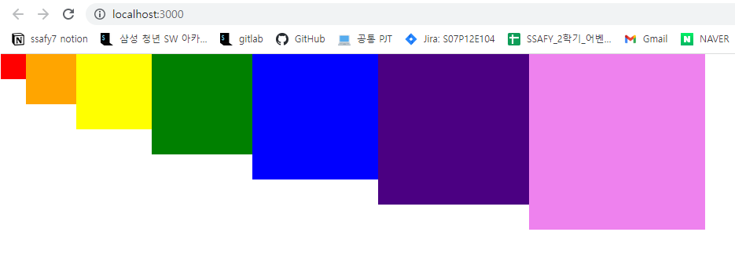
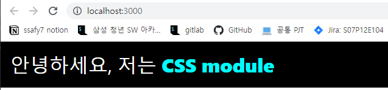
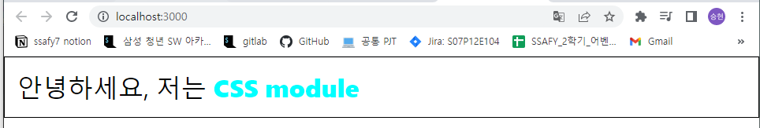

# 컴포넌트 스타일링

[TOC]

💡 **컴포넌트 스타일링 방식**

- 일반 CSS : 컴포넌트를 스타일링하는 가장 기본적인 방식
- Sass : 자주 사용되는 CSS 전처리기 중 하나로 확장된 CSS 문법을 사용하여 코드를 더욱 쉽게 작성할 수 있도록 해줌
- CSS Module :  스타일을 작성할 때 CSS 클래스가 다른 CSS 클래스의 이름과 절대 충돌하지 않도록 파일마다 고유한 이름을 자동으로 생성해 주는 옵션
- styled-component : 스타일을 자바스크립트 파일에 내장시키는 방식으로 스타일을 작성함과 동시에 해당 스타일이 적용된 컴포넌트를 만들 수 있게 해줌


## 01. 일반 CSS

✔ CSS 클래스를 **중복되지 않게** 만들어야 함

1. 특별한 규칙으로 이름 짓기
2. CSS Selector 이용


### 01-1. 이름 짓는 규칙

- `컴포넌트이름-클래스` 형태
  - `App-header`

- BEM 네이밍 : 해당 클래스가 어디에서 어떤 용도로 사용되는지 명확하게 작성 
  - `.card_title-primary`


### 01-2.CSS Selector

- CSS 클래스가 특정 클래스 내부에 있는 경우에만 스타일 적용 가능

```css
.App .logo {
  height: 40vmin;
  pointer-events: none;
}
```

> .App 안에 들어 있는 .logo에 스타일을 적용


➕ **App.css 및 App.js 수정**

```css
// App.css

.App {
  text-align: center;
}

/* .App안에 들어 있는 .logo */
.App .logo {
  height: 40vmin;
  animation: App-logo-spin infinite 20s linear;
}

/* .App안에 들어 있는 header
    header 클래스가 아닌 태그 자체에 스타일을 적용하기 때문에 . 생략 */
.App header {
  background-color: #282c34;
  min-height: 100vh;
  display: flex;
  flex-direction: column;
  align-items: center;
  justify-content: center;
  font-size: calc(10px + 2vmin);
  color: white;
}

/* .App안에 있는 a태그 */ 
.App a {
  color: #61dafb;
}

@keyframes App-logo-spin {
  from {
    transform: rotate(0deg);
  }
  to {
    transform: rotate(360deg);
  }
}
```

```react
// App.js

import { Component } from 'react';
import logo from './logo.svg';
import './App.css';

class App extends Component {
  render() {
    return (
      <div className="App">
        <header>
          
          <p>
            Edit <code>src/App.js</code> and save to reload.
          </p>
          <a
            href="https://reactjs.org"
            target="_blank"
            rel="noopener noreferrer"
          >
            Learn React
          </a>
        </header>
      </div>
    );
  };
}

export default App;
```


---


## 02. Sass 사용하기

✔ **Sass** (Syntactically Awesome Style Sheets)

: CSS 전처리기로 복잡한 작업을 쉽게 할 수 있도록 해 주고, 스타일 코드의 재활용성을 높여 줄 뿐만 아니라 코드의 가독성을 높여 유지 보수를 더욱 쉽게 해줌

- 확장자 : `.scss` , `.sass`

```sas
$font-stack: Helvetica, sans-serif
$primary-color: #333

body
	font: 100% $font-stack
	color: $primary-color
```

> .sass
>
> - 중괄호 {} 와 세미콜론 ; 을 사용하지 않음

```scss
$font-stack: Helvetica, sans-serif;
$primary-color: #333;

body {
	font: 100% $font-stack;
	color: $primary-color;   
}
```

> .scss
>
> - 기존 CSS를 작성하는 방식과 문법이 유사


---

#### sass 라이브러리 설치

```bash
$ yarn add sass
```

---

```scss
// SassComponent.scss

// 변수 사용하기
$red: #fa5252;
$orange: #fd7e14;
$yellow: #fcc419;
$green: #40c057;
$blue: #339af0;
$indige: #5c7cfa;
$violet: #7950f2;

// 믹스인 만들기 (재사용되는 스타일 블록을 함수처럼 사용할 수 있음)
@mixin square($size) {
    $calculated: 32px * $size;
    width: $calculated;
    height: $calculated;
}

.SassComponent {
    display: flex;
    
    .box { // 일반 컴포넌트에서는 .SassComponent .box와 같은
        background: red;
        cursor: pointer;
        transition: all 0.3s ease-in;
        
        &.red {
            // .red 클래스가 .box와 함께 사용되었을 때
            background: red;
            @include square(1);
        }
        &.orange {
            background: orange;
            @include square(2);
        }
        &.yellow {
            background: yellow;
            @include square(3);
        }
        &.green {
            background: green;
            @include square(4);
        }
        &.blue {
            background: blue;
            @include square(5);
        }
        &.indigo {
            background: indigo;
            @include square(6);
        }
        &.violet {
            background: violet;
            @include square(7);
        }
        &:hover {
            // .box에 마우스를 올렸을 때
            background: black;
        }
    }
}
```

```react
// SassComponent.js

import './SassComponent.scss';

const SassComponent = () => {
    return (
        <div className="SassComponent">
            <div className="box red"/>
            <div className="box orange"/>
            <div className="box yellow"/>
            <div className="box green"/>
            <div className="box blue"/>
            <div className="box indigo"/>
            <div className="box violet"/>
        </div>
    );
};

export default SassComponent;
```

```react
// App.js

import { Component } from 'react';
import SassComponent from './SassComponent';

class App extends Component {
  render() {
    return (
      <div>
        <SassComponent />
      </div>  
    );
  };
}

export default App;
```




### 02-1. utils 함수 분리

```scss
// src/styles/utils.scss

// 변수 사용하기
$red: #fa5252;
$orange: #fd7e14;
$yellow: #fcc419;
$green: #40c057;
$blue: #339af0;
$indige: #5c7cfa;
$violet: #7950f2;

// 믹스인 만들기 (재사용되는 스타일 블록을 함수처럼 사용할 수 있음)
@mixin square($size) {
    $calculated: 32px * $size;
    width: $calculated;
    height: $calculated;
}
```

```scss
// SassComponent.scss

@import './styles/utils.scss';

.SassComponent {
    display: flex;
    
    .box { // 일반 컴포넌트에서는 .SassComponent .box와 같은
        background: red;
        cursor: pointer;
        transition: all 0.3s ease-in;
        ...
    }
```

> 다른 scss 파일을 불러올 때는 **@import** 구문 사용


### 02-2. sass-loader 설정 커스터마이징

- 프로젝트에 디렉터리가 많아 구조가 깊어진 경우, 상위폴더로 한참 거슬러 올라가야 하는 문제 해결

```bash
$ git add .
$ git commit -m 'Commit before yarn eject'
$ yarn eject
$ react-scripts eject >> y
```

> 세부 설정을 밖으로 꺼냄
>
> 아직 git에 커밋되지 않은 변화가 있다면 진행되지 않으므로, 먼저 커밋해주어야 함


- config 디렉토리의 webpack.config.js 열기 > sassRegex 찾기

```js
{
    test: sassRegex,
        exclude: sassModuleRegex,
            use: getStyleLoaders(
                {
                    importLoaders: 3,
                    sourceMap: isEnvProduction
                    ? shouldUseSourceMap
                    : isEnvDevelopment,
                    modules: {
                        mode: 'icss',
                    },
                },
                'sass-loader'
            ),
                sideEffects: true,
},
```

```js
{
    test: sassRegex,
        exclude: sassModuleRegex,
            use: getStyleLoaders(
                {
                    importLoaders: 3,
                    sourceMap: isEnvProduction
                    ? shouldUseSourceMap
                    : isEnvDevelopment
                }).concat({
                loader: require.resolve("sass-loader"),
                options: {
                    sassOptions: {
                        includePaths: [paths.appSrc + "/styles"],
                    },
                },
            }),
                sideEffects: true,
},
```

> 수정하고 저장한 후, 서버 재시작
>
> scss 파일 경로가 어디에 위치하더라도 앞부분에 상대경로를 입력할 필요 없이 styles 디렉터리 기준 절대 경로를 사용하여 불러옴

- SassComponent.scss 에서 `@import 'utils.scss';` 를 해도 동일하게 동작


✔ **additionalData** : Sass 파일을 불러올 때마다 코드의 맨 윗부분에 특정 코드를 포함

```scss
// webpack.config.js 

{
    test: sassRegex,
    exclude: sassModuleRegex,
    use: getStyleLoaders(
        {
            importLoaders: 3,
            sourceMap: isEnvProduction
            ? shouldUseSourceMap
            : isEnvDevelopment
    }).concat({
        loader: require.resolve("sass-loader"),
        options: {
            sassOptions: {
                includePaths: [paths.appSrc + "/styles"],
            },
            additionalData: "@import 'utils';",
        },
    }),
    sideEffects: true,
},
```


### 02-3. node_modules에서 라이브러리 불러오기

```react
@import '../../../node_modules/library/styles';

// 대체 하는 방법 : 물결문자(~)
@import '~library/styles';
```

> 물결문자를 사용하면 자동으로 node_modules에서 라이브러리 디렉터리를 탐지하여 스타일을 불러옴


✔ **include-media, open-color 설치하기**

```bash
$ yarn add open-color include-media
```

```scss
// utils.scss

@import '~include-media/dist/include-media';
@import '~open-color/open-color';
...
```

> Sass라이브러리를 불러올 때는 nodw_modules 내부 라이브러라 경로 안에 있는 scss 파일을 불러와야 함.
>
> scss 파일 경로는 직접 경로로 들어가서 확인

```scss
// SassComponent.scss

@import 'utils.scss';

.SassComponent {
    display: flex;

    background: $oc-gray-2;
    @include media('<768px') {
        background: $oc-gray-9;
    }
    ...
}
```


---


## 03. CSS Module

- CSS를 불러와서 사용할 때 클래스 이름을 고유한 값 **`[파일 이름]_[클래스 이름]_[해시값]`** 형태로 자동으로 만들어서 컴포넌트 스타일 클래스 이름이 중첩되는 현상을 방지하는 기술

- `.module.css` 확장자로 파일을 저장하기만 하면 CSS Module이 지정됨.

```css
/* CSSModule.module.css */ 

/* 자동으로 고유해질 것이므로 흔히 사용되는 단어를 클래스 이름으로 마음대로 사용 가능 */
.wrapper {
    background: black;
    padding: 1rem;
    color: white;
    font-size: 2rem;
}

/* 글로벌 CSS를 작성하고 싶다면 */
:global .something {
    font-weight: 800;
    color: aqua;
}
```

✔ 특정 클래스가 웹 페이지에 전역적으로 사용되는 경우 `:global` 을 앞에 !


```react
// CSSModule.js

import styles from './CSSModule.module.css';

const CSSModule = () => {
    return (
        <div className={styles.wrapper}>
            안녕하세요, 저는 <span className="something">CSS module</span>
        </div>
    )
}

export default CSSModule;
```

```react
// App.js

import { Component } from 'react';
import CSSModule from './CSSModule';

class App extends Component {
  render() {
    return (
      <div>
        <CSSModule />
      </div>  
    );
  };
}

export default App;
```



- JSX 엘리먼트에 `className={styles.[클래스이름]}` 형태로 전달


```css
/* CSSModule.module.css */

.wrapper {
    background: black;
    padding: 1rem;
    color: white;
    font-size: 2rem;
}

.inverted {
    color: black;
    background: white;
    border: 1px solid black;
}

/* 글로벌 CSS를 작성하고 싶다면 */
:global .something {
    font-weight: 800;
    color: aqua;
}
```

```react
// CSSModule.js

import styles from './CSSModule.module.css';

const CSSModule = () => {
    return (
        <div className={`${styles.wrapper} ${styles.inverted}`}>
            안녕하세요, 저는 <span className="something">CSS module</span>
        </div>
    )
}

export default CSSModule;
```




- ```
  className={`${styles.wrapper} ${styles.inverted}`}
  ```

- ```
  className={[styles.wrapper, styles.inverted].join(' ')}


### 03-1. classnames

: CSS 클래스를 조건부로 설정할 때 유용한 라이브러리

```bash
$ yarn add classnames
```

> 라이브러리 설치하기


✔ **classmates** 의 간략 사용법

```js
import classNames form 'classnames';

classNames('one', 'two');             // = 'one two'
classNames('one', { two: true });     // = 'one two'
classNames('one', { two: false });    // = 'one'
classNames('one', ['two', 'three']);  // = 'one two three'

const myClass = 'hello';
classNames('one', myClass, { myCondition: true }); // = 'one hello myCondition'
```

```react
const MyComponent = ({ highlighted, theme }) => (
	<div className={classNames('MyComponent', { highlighted }, theme)}>Hello</div>
);
```

> - highlighted 값이 true면, highlighted 클래스가 적용되고 false면, 적용되지 않음
>
> - theme 로 전달받는 문자열은 내용 그대로 클래스에 적용됨


- classnames에 내장되어 있는 bind 함수를 사용하면 클래스를 넣어줄 때마다 styles.[클래스 이름] 형태를 사용할 필요가 없음
- 사전에 미리 styles에서 받아 온 후 사용하게끔 설정해두고 `cx('클래스 이름', '클래스 이름2')` 형태로 사용


```react
import classNames from 'classnames/bind';
import styles from './CSSModule.module.css';

const cx = classNames.bind(styles);  // 미리 styles에서 클래스를 받아오도록 설정하고

const CSSModule = () => {
    return (
    	<div className={cx('wrapper', 'inverted')}>
    		안녕하세요, 저는 <span className="something">CSS Module!</span>
        </div>
    );
};

export default CSSModule;
```


### 03-2. Sass와 함께 사용하기

- sass를 사용할 때도 .module.scss 확장자로 CSS Module 사용 가능

```scss
// CSSModule.module.scss

/* 자동으로 고유해질 것이므로 흔히 사용되는 단어를 클래스 이름으로 마음대로 사용 가능 */
.wrapper {
    background: black;
    padding: 1rem;
    color: white;
    font-size: 2rem;

    &.inverted {
        // .inverted가 .wrapper와 함께 사용되었을 때만 적용
        color: black;
        background: white;
        border: 1px solid black;
    }
}


/* 글로벌 CSS를 작성하고 싶다면 */
:global {
    .something {
        font-weight: 800;
        color: aqua;
    }
}
```


### 03-3. CSS Module이 아닌 파일에서 CSS Module 사용하기

- 일반 .css/.scss 파일에서도 `:local` 을 사용하여 CSS Module 사용가능

```css
:local .wrapper {
	/* 스타일 */
}

:local {
    .wrapper {
        /* 스타일 */
    }
}
```

---


## 04. styled-components

- **CSS-in-JS** : js 파일 안에 스타일을 선언하는 방식

- https://github.com/MicheleBertoli/css-in-js


✔ **styled-components** 설치

```bash
$ yarn add styled-components
```

```react
// StyledComponent.js

import styled, {css} from "styled-components";

const Box = styled.div`
    /* props로 넣어 준 값을 직접 전달해 줄 수 있음 */
    background: ${props => props.color || 'blue'};
    padding: 1rem;
    display: flex;
`;

const Button = styled.button`
    background: white;
    color: black;
    border-radius: 4px;
    padding: 0.5rem;
    display: flex;
    align-items: center;
    box-sizing: border-box;
    font-size: 1rem;
    font-weight: 600;

    /* & 문자를 사용하여 Sass 처럼 자기 자신 선택 가능 */
    &:hover {
        background: rgba(255, 255, 255, 0.9);
    }

    ${props => 
        props.inverted && css`
            background: none;
            border: 2px solid white;
            color: white;
            &:hover {
                background: white;
                color: black;
            }
        `};
        & + button {
            margin-left: 1rem;
        }
`;

const StyledComponent = () => (
    <Box color="black">
        <Button>안녕하세요</Button>
        <Button inverted={true}>테두리만</Button>
    </Box>
);

export default StyledComponent;
```

```react
// App.js

import { Component } from 'react';
import StyledComponent from './StyledComponent';

class App extends Component {
  render() {
    return (
      <div>
        <StyledComponent />
      </div>  
    );
  };
}

export default App;
```


### 04-1. Tagged 템플릿 리터럴

- 스타일을 작성할 때 `을 사용하여 만든 문자열에 스타일 정보를 넣을 때 사용하는 문법

- 템플릿 안에 자바스크립트 객체나 함수를 전달할 때, 온전히 추출 가능


```css
`hello ${{foo: 'bar' }} ${() => 'world'}!`
// 결과: "hello [object object] () => 'world'!"
```

> 템플릿에 객체를 넣거나 함수를 넣으면 형태를 잃어버리게 됨
>
> 객체는 [Object Object]로 변환되고 함수는 함수 내용이 그대로 문자열화되어 나타남

```javascript
function tagged(...args) {
    console.log(args);
}

tagged`hello ${{foo: 'bar' }} ${() => 'world'}!`
```

> 템플릿 사이사이에 들어가는 자바스크립트 객체나 함수의 원본 값을 그대로 추출


### 04-2. 스타일링된 엘리먼트 만들기

- 컴포넌트 파일의 상단에서 styled를 import 하고 `styled.태그명` 을 사용하여 구현

```react
import styled from "styled-components";

const MyComponent = styled.div`
	font-size: 2rem;
`;`
```


- 사용해야 할 태그명이 유동적이거나 특정 컴포넌트 자체에 스타일링해 주고 싶을 때

```react
// 태그의 타입을 styled 함수의 인자로 전달

const MyInput = styled('input')`
	background: gray;
`;

// 아예 컴포넌트 형식의 값을 넣어줌
const StyledLink = styled(Link)`
	color: blue;
`
```


### 04-3. 스타일에서 props 조회하기

```react
// StyledComponent.js

const Box = styled.div`
    /* props로 넣어 준 값을 직접 전달해 줄 수 있음 */
    background: ${props => props.color || 'blue'};
    padding: 1rem;
    display: flex;
`;
```

> props를 조회해서 props.color 값을 사용 (default: blue)
>
> `<Box color="black">(....)</Box>`


### 04-4. props에 따른 조건부 스타일링

```react
// StyledComponent.js - Button


const Button = styled.button`
    background: white;
    color: black;
    border-radius: 4px;
    padding: 0.5rem;
    display: flex;
    align-items: center;
    box-sizing: border-box;
    font-size: 1rem;
    font-weight: 600;

    /* & 문자를 사용하여 Sass 처럼 자기 자신 선택 가능 */
    &:hover {
        background: rgba(255, 255, 255, 0.9);
    }

    /* inverted 값이 true 일 때, 특정 스타일을 부여해줌 */
    ${props => props.inverted && css`
        background: none;
        border: 2px solid white;
        color: white;
        &:hover {
            background: white;
            color: black;
        }
    `};
    & + button {
        margin-left: 1rem;
    }
`;
```

✔ **props를 참조한다면, 반드시 CSS로 감싸 주어서 Tagged 템플릿 리터럴을 사용해야함**


### 04-5. 반응형 디자인

- `media` 쿼리 이용

```react
// StyledCompoentn.js - Box

const Box = styled.div`
    /* props로 넣어 준 값을 직접 전달해 줄 수 있음 */
    background: ${props => props.color || 'blue'};
    padding: 1rem;
    display: flex;

    /*  기본적으로는 가로 1024px에 가운데 정렬을 하고
        가로 크기가 작아짐에 따라 크기를 줄이고
        768px 미만이 되면 꽉 채웁니다   */
    width: 1024px;
    margin: 0 auto;
    @media (max-width: 1024px) {
        width: 768px;
    }

    @media (max-width: 768px) {
        width: 100%;
    }
`;
```

