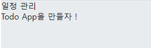
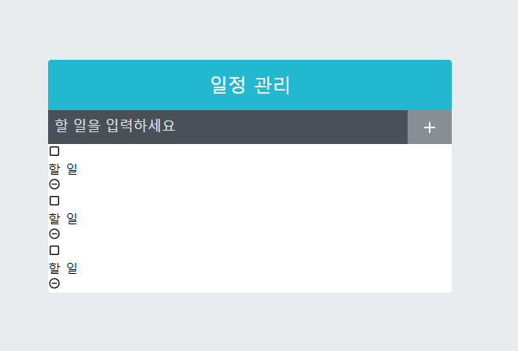

# 일정관리 웹 애플리케이션 만들기

[TOC]


## 01. 프로젝트 준비

### 01-1. 프로젝트 생성 및 라이브러리 설치

```bash
$ yarn create react-app todo-app
$ yarn add sass classnames react-icons
```

> react-icons: 리액트에서 다양하고 예쁜 아이콘을 사용할 수 있는 라이브러리
>
> https://react-icons.github.io/react-icons/
>
> - SVG 형태로 이루어진 아이콘을 리액트 컴포넌트처럼 매우 쉽게 사용 가능
> - 아이콘의 크기나 색상은 props 또는 CSS 스타일로 변경하여 사용 가능


### 01-2. prettier 설정

- 최상위 폴더에 `.prettierrc`  파일 생성

  ```json
  {
      "singleQuote": true,
      "semi": true,
      "useTabs": false,
      "tabWidth": 2,
      "trailingComma": "all",
      "printWidth": 80
  }
  ```

  

### 01-3. index.css 수정

```css
body {
  margin: 0;
  padding: 0;
  background: #e9ecef;
}
```


### 01-4. App 컴포넌트 초기화

```react
// App.js

const App = () => {
  return <div>
    Todo App을 만들자 !
  </div>
};

export default App;
```


```bash
$ yarn start
```


---


## 02. UI 구성

💡 **디렉토리 생성** : `src/components/` 

1. **TodoTemplate** 
   - 화면을 가운데에 정렬시켜 주며, 앱 타이틀 (일정 관리)를 보여줌
   - children으로 내부 JSX를 props로 받아와서 렌더링
2. **TodoInsert**
   - 새로운 항목을 입력하고 추가할 수 있는 컴포넌트
   - state를 통해 인풋의 상태 관리
3. **TodoListItem**
   - 각 할 일 항목에 대한 정보를 보여 주는 컴포넌트
   - todo 객체를 props로 받아와서 상태에 따라 다른 스타일의 UI를 보여줌
4. **TodoList**
   - todos 배열을 props로 받아 온 후, 이를 배열 내장 함수 map을 사용해서 여러개의 TodoListItem 컴포넌트로 보여줌


### 02-1. TodoTemplate

```react
// components/TodoTemplate.js

import './TodoTemplate.scss';

const TodoTemplate = ({ children }) => {
    return (
        <div className="TodoTemplate">
            <div className="app-title">일정 관리</div>
            <div className="content">{children}</div>
        </div>
    );
};

export default TodoTemplate;
```

```react
// App.js

import TodoTemplate from './components/TodoTemplate';

const App = () => {
  return <TodoTemplate>
    Todo App을 만들자 !
  </TodoTemplate>
};

export default App;
```


➕ **닫혀 있는 파일 자동완성**

1. 최상위 디렉터리에 `jsconfig.js` 파일 생성
2. 파일 열기
3. `ctrl` + `space` => `enter`





```scss
// components/TodoTemplate.scss

.TodoTemplate {
    width: 512px;
    // width가 주어진 상태에서 좌우 중앙 정렬
    margin-left: auto;
    margin-right: auto;
    margin-top: 6rem;
    border-radius: 4px;
    overflow: hidden;

    .app-title {
        background: #22b8cf;  // 배경색
        color: white;   // 글자색
        height: 4rem;
        font-size: 1.5rem;
        display: flex;
        align-items: center;
        justify-content: center;
    }
    
    .content {
        background: white;
    }    

}
```


### 02-2. TodoInsert

```react
// components/TodoInsert.js

import { MdAdd } from 'react-icons/md';
import './TodoInsert.scss'

const TodoInsert = () => {
    return (
        <form className="TodoInsert">
            <input placeholder="할 일을 입력하세요"/>
            <button type="submit">
                <MdAdd/>
            </button>
        </form>
    );
};

export default TodoInsert;
```

```react
// App.js

import TodoInsert from './components/TodoInsert';
import TodoTemplate from './components/TodoTemplate';

const App = () => {
  return <TodoTemplate>
    <TodoInsert/>
  </TodoTemplate>
};

export default App;
```

```scss
// components/TodoInset.scss

.TodoInsert {
    display: flex;
    background: #495057;

    input {
        // 기본 스타일 초기화
        background: none;
        outline: none;
        border: none;
        padding: 0.5rem;
        font-size: 1.125rem;
        line-height: 1.5;
        color: white;

        &::placeholder {
            color: #dee2e6;
        }

        // 버튼을 제외한 영역 모두 차지하기
        flex: 1;
    }

    button {
        // 기본스타일 초기화
        background: none;
        outline: none;
        border: none;
        background: #868e96;
        color: white;
        padding-left: 1rem;
        padding-right: 1rem;
        font-size: 1.5rem;
        display: flex;
        align-items: center;
        cursor: pointer;
        transition: 0.1s background ease-in;
        &:hover { 
            background: #adb5bd;
        }
    }
}
```


### 02-3. TodoListItem & TodoList

```react
// components/TodoListItem.js

import {
    MdCheckBoxOutlineBlank,
    MdCheckBox,
    MdRemoveCircleOutline,
} from 'react-icons/md';
import './TodoListItem.scss';

const TodoListItem = () => {
    return (
        <div className="TodoListItem">
            <div className="checkBox">
                <MdCheckBoxOutlineBlank/>
                <div className="text">할 일</div>
            </div>
            <div className="remove">
                <MdRemoveCircleOutline/>
            </div>
        </div>
    )
};

export default TodoListItem;
```

> MdCheckBox : 할 일이 완료되었을 때 체크된 상태를 보여주기 위해 사용

```react
// components/TodoList.js

import TodoListItem from "./TodoListItem";
import './TodoList.scss';

const TodoList = () => {
    return (
        <div className="TodoList">
            <TodoListItem/>
            <TodoListItem/>
            <TodoListItem/>
        </div>
    )
};

export default TodoList;
```

```react
// App.js

import TodoInsert from './components/TodoInsert';
import TodoList from './components/TodoList';
import TodoTemplate from './components/TodoTemplate';

const App = () => {
  return <TodoTemplate>
    <TodoInsert/>
    <TodoList/>
  </TodoTemplate>
};

export default App;
```




```scss
// components/TodoList.scss

.TodoList {
    min-height: 320px;
    max-height: 513px;
    overflow-y: auto;
}
```

```scss
// TodoListItem.scss

.TodoListItem {
    padding: 1rem;
    display: flex;
    align-items: center;  // 세로 중앙 정렬
    &:nth-child(even) {
        background: #f8f9fa;
    }

    .checkbox {
        cursor: pointer;
        flex: 1;   // 차지할 수 있는 모든 영역 차지
        display: flex;
        align-items: center;  // 세로 중앙 정렬
        svg {
            // 아이콘
            font-size: 1.5rem;
        }

        .text {
            margin-left: 0.5rem;
            flex: 1;  // 차지할 수 있는 모든 영역 차지
        }

        // 체크되었을 때 보여줄 스타일
        &.checked {
            svg {
                color: #22b8cf;
            }
            .text {
                color: #adb5bd;
                text-decoration: line-through;
            }
        }
    }
    .remove {
        display: flex;
        align-items: center;
        font-size: 1.5rem;
        color: #ff6b6b;
        cursor: pointer;
        &:hover {
            color: #ff8787;
        }
    }

    // 엘리먼트 사이사이에 테두리를 넣어줌
    & + & {
        border-top: 1px solid #dee2d6;
    }
}
```


---


## 03. 기능 구현

### 03-1. App에서 todos 상태 사용하기

- App 에서 useState를 사용하여 todos라는 상태를 정의하고, todos를 TodoList의 props로 전달

```react
// App.js

import { useState } from 'react';
import TodoInsert from './components/TodoInsert';
import TodoList from './components/TodoList';
import TodoTemplate from './components/TodoTemplate';

const App = () => {
  const [todos, setTodos] = useState([
    {
      id: 1,
      text: '리액트의 기초 알아보기',
      checked: true,
    },
    {
      id: 2,
      text: '컴포넌트 스타일링 해보기',
      checked: true,
    },
    {
      id: 3,
      text: '일정 관리 앱 만들기',
      checked: false,
    },
  ]);

  return <TodoTemplate>
    <TodoInsert/>
    <TodoList todos={todos}/>
  </TodoTemplate>
};

export default App;
```

```react
// TodoList.js

import TodoListItem from "./TodoListItem";
import './TodoList.scss';

const TodoList = ({ todos }) => {
    return (
        <div className="TodoList">
            {todos.map(todo => (
                <TodoListItem todo={todo} key={todo.id} />
            )
            )}
        </div>
    )
};

export default TodoList;
```

```react
// TodoListItem.js

import {
    MdCheckBoxOutlineBlank,
    MdCheckBox,
    MdRemoveCircleOutline,
} from 'react-icons/md';
import cn from 'classnames';
import './TodoListItem.scss';

const TodoListItem = ({ todo }) => {
    const { text, checked } = todo;

    return (
        <div className="TodoListItem">
            <div className={cn("checkbox", { checked })}>
                {checked ? <MdCheckBox/> : <MdCheckBoxOutlineBlank/>}
                <div className="text">{text}</div>
            </div>
            <div className="remove">
                <MdRemoveCircleOutline/>
            </div>
        </div>
    )
};

export default TodoListItem;
```


### 03-2. 항목 추가 기능 구현하기

- TodoInsert 컴포넌트에서 인풋 상태를 관리하고 App 컴포넌트에는 todos 배열에 새로운 객체를 추가하는 함수를 만들어야 함.

#### TodoInsert value 상태 관리하기

```react
// TodoInsert.js

import { useState, useCallback } from 'react';
import { MdAdd } from 'react-icons/md';
import './TodoInsert.scss'

const TodoInsert = () => {
    const [value, setvalue] = useState('');

    const onChange = useCallback(e => {
        setvalue(e.target.value);
    }, []);

    return (
        <form className="TodoInsert">
            <input placeholder="할 일을 입력하세요"
                value={value}
                onChange={onChange}
            />
            <button type="submit">
                <MdAdd/>
            </button>
        </form>
    );
};

export default TodoInsert;
```


#### todos 배열에 새 객체 추가하기

```react
// App.js

import { useState, useRef, useCallback } from 'react';
import TodoInsert from './components/TodoInsert';
import TodoList from './components/TodoList';
import TodoTemplate from './components/TodoTemplate';

const App = () => {
  const [todos, setTodos] = useState([
    {
      id: 1,
      text: '리액트의 기초 알아보기',
      checked: true,
    },
    {
      id: 2,
      text: '컴포넌트 스타일링 해보기',
      checked: true,
    },
    {
      id: 3,
      text: '일정 관리 앱 만들기',
      checked: false,
    },
  ]);

  // 고윳값으로 사용될 id
  // ref를 사용하여 변수 담기

  const nextId = useRef(4);

  const onInsert = useCallback(
    text => {
      const todo = {
        id: nextId.current,
        text,
        checked: false,
      };

      setTodos(todos.concat(todo));
      nextId.current += 1
    },
    [todos],
  );

  return (
  <TodoTemplate>
    <TodoInsert onInsert={onInsert}/>
    <TodoList todos={todos}/>
  </TodoTemplate>
  )
};

export default App;
```


#### TodoInsert에서 onSubmit 이벤트 설정

- App에서 TodoInsert에 넣어 준 onInsert 함수에 현재 useState를 통해 관리하고 있는 value 값을 파라미터로 넣어서 호출

```react
// TodoInsert.js

import { useState, useCallback } from 'react';
import { MdAdd } from 'react-icons/md';
import './TodoInsert.scss'

const TodoInsert = ({ onInsert }) => {
    const [value, setValue] = useState('');

    const onChange = useCallback(e => {
        setValue(e.target.value);
    }, []);

    const onSubmit = useCallback(e => {
        onInsert(value);
        setValue(''); // value 초기화

        // submit 이벤트는 브라우저에서 새로고침을 발생시킴
        e.preventDefault();
    }, [onInsert, value],
    )

    return (
        <form className="TodoInsert" onSubmit={onSubmit}>
            <input placeholder="할 일을 입력하세요"
                value={value}
                onChange={onChange}
            />
            <button type="submit">
                <MdAdd/>
            </button>
        </form>
    );
};

export default TodoInsert;
```

- onSubmit 함수 호출 시,
  - props로 받아 온 onInsert 함수에 현재 value 값을 파라미터로 넣어서 호출하고, 현재 value 초기화
- onSubmit 이벤트는 브라우저를 새로고침시킴 => `e.preventDefault()` 로 방지
  - onClick 이벤트로도 처리 가능
  - onSubmit은 input에서 enter를 눌렀을 때도 발생


### 03-3. 지우기 기능

#### 배열 내장 함수 filter

```react
const array = [1, 2, 3, 4, 5, 6, 7, 8, 9, 10];
const biggerThanFive = array.filter(number => number > 5);
// 결과: [6, 7, 8, 9, 10]
```

- 조건을 확인해 주는 함수를 파라미터로 넣어 줌


#### todos 배열에서 id로 항목 지우기

```react
// App.js

import { useState, useRef, useCallback } from 'react';
import TodoInsert from './components/TodoInsert';
import TodoList from './components/TodoList';
import TodoTemplate from './components/TodoTemplate';

const App = () => {
  const [todos, setTodos] = useState([
    {
      id: 1,
      text: '리액트의 기초 알아보기',
      checked: true,
    },
    {
      id: 2,
      text: '컴포넌트 스타일링 해보기',
      checked: true,
    },
    {
      id: 3,
      text: '일정 관리 앱 만들기',
      checked: false,
    },
  ]);

  // 고윳값으로 사용될 id
  // ref를 사용하여 변수 담기

  const nextId = useRef(4);

  const onInsert = useCallback(
    text => {
      const todo = {
        id: nextId.current,
        text,
        checked: false,
      };

      setTodos(todos.concat(todo));
      nextId.current += 1
    },
    [todos],
  );

  const onRemove = useCallback (
    id => {
      setTodos(todos.filter(todo => todo.id !== id));
    }, [todos],
  );

  return (
  <TodoTemplate>
    <TodoInsert onInsert={onInsert}/>
    <TodoList todos={todos} onRemove={onRemove}/>
  </TodoTemplate>
  )
};

export default App;
```


#### TodoListItem에서 삭제 함수 호출하기

```react
// TodoList.js

import TodoListItem from "./TodoListItem";
import './TodoList.scss';

const TodoList = ({ todos, onRemove }) => {
    return (
        <div className="TodoList">
            {todos.map(todo => (
                <TodoListItem todo={todo} key={todo.id} onRemove={onRemove}/>
            )
            )}
        </div>
    )
};

export default TodoList;
```

```react
// TodoListItem.js

import {
    MdCheckBoxOutlineBlank,
    MdCheckBox,
    MdRemoveCircleOutline,
} from 'react-icons/md';
import cn from 'classnames';
import './TodoListItem.scss';

const TodoListItem = ({ todo, onRemove }) => {
    const { id, text, checked } = todo;

    return (
        <div className="TodoListItem">
            <div className={cn("checkbox", { checked })}>
                {checked ? <MdCheckBox/> : <MdCheckBoxOutlineBlank/>}
                <div className="text">{text}</div>
            </div>
            <div className="remove" onClick={() => onRemove(id)}>
                <MdRemoveCircleOutline/>
            </div>
        </div>
    )
};

export default TodoListItem;
```


### 03-4. 수정 기능

- onToggle이라는 함수를 App에 만들고, 해당 함수를 TodoList 컴포넌트에 props로 주고, TodoList를 통해 TodoListItem까지 전달

#### onToggle 구현

```react
// App.js

import { useState, useRef, useCallback } from 'react';
import TodoInsert from './components/TodoInsert';
import TodoList from './components/TodoList';
import TodoTemplate from './components/TodoTemplate';

const App = () => {
  const [todos, setTodos] = useState([
    {
      id: 1,
      text: '리액트의 기초 알아보기',
      checked: true,
    },
    {
      id: 2,
      text: '컴포넌트 스타일링 해보기',
      checked: true,
    },
    {
      id: 3,
      text: '일정 관리 앱 만들기',
      checked: false,
    },
  ]);

  // 고윳값으로 사용될 id
  // ref를 사용하여 변수 담기

  const nextId = useRef(4);

  const onInsert = useCallback(
    text => {
      const todo = {
        id: nextId.current,
        text,
        checked: false,
      };

      setTodos(todos.concat(todo));
      nextId.current += 1
    },
    [todos],
  );

  const onRemove = useCallback (
    id => {
      setTodos(todos.filter(todo => todo.id !== id));
    }, [todos],
  );

  const onToggle = useCallback (
    id => {
      setTodos(todos.map(todo => 
        todo.id !== id ? {...todo, checked: !todo.checked } : todo, ),
        );
    }, [todos],
  );

  return (
  <TodoTemplate>
    <TodoInsert onInsert={onInsert}/>
    <TodoList todos={todos} onRemove={onRemove} onToggle={onToggle}/>
  </TodoTemplate>
  )
};

export default App;
```


#### TodoListItem에서 토글 함수 호출하기

```react
// TodoList.js

import TodoListItem from "./TodoListItem";
import './TodoList.scss';

const TodoList = ({ todos, onRemove, onToggle }) => {
    return (
        <div className="TodoList">
            {todos.map(todo => (
                <TodoListItem todo={todo} key={todo.id} onRemove={onRemove} onToggle={onToggle}/>
            )
            )}
        </div>
    )
};

export default TodoList;
```

```react
// TodoListItem.js

import {
    MdCheckBoxOutlineBlank,
    MdCheckBox,
    MdRemoveCircleOutline,
} from 'react-icons/md';
import cn from 'classnames';
import './TodoListItem.scss';

const TodoListItem = ({ todo, onRemove, onToggle }) => {
    const { id, text, checked } = todo;

    return (
        <div className="TodoListItem">
            <div className={cn("checkbox", { checked })} onClick={() => onToggle(id)}>
                {checked ? <MdCheckBox/> : <MdCheckBoxOutlineBlank/>}
                <div className="text">{text}</div>
            </div>
            <div className="remove" onClick={() => onRemove(id)}>
                <MdRemoveCircleOutline/>
            </div>
        </div>
    )
};

export default TodoListItem;
```

