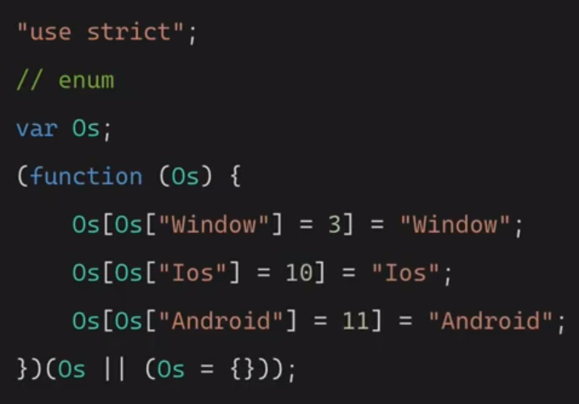
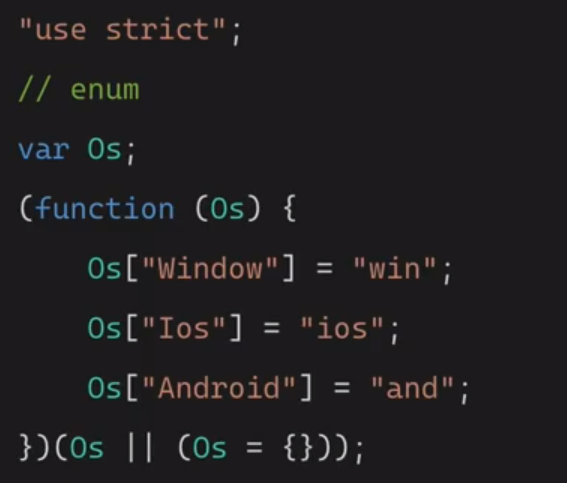

# 타입스크립트

[TOC]

---

## 기본타입

✔ **number / string / boolean / array**

```typescript
let car: string = 'bmw';
let age: number = 30;
let isAdult: boolean = true;
let a: number[] = [1, 2, 3];
let a2: Array<number> = [1, 2, 3];

let week1: string[] = ['mon', 'tue', 'wed'];
let week2: Array<string> = ['mon', 'tue', 'wed'];

week1.push(3); // 문자열 배열에 숫자를 추가하려고 하므로 Error 발생
```


✔ **tuple**

```typescript
let b:[string, number]; // 배열의 첫번째 요소는 string, 두번째 요소는 number

b = ['z', 1]; // 가능
// b = [1, 'z']; // 순서가 반대이므로 불가능

b[0].toLowerCase();
// b[1].toLowerCase(); // number 타입이므로 불가능
```


✔ **void / never**

- `void` : 함수에서 반환하는 것이 없는 경우

```typescript
function sayHello(): void {
    console.log('hello');
}
```

- `never` : 항상 에러를 반환하거나 영원히 끝나지 않는 함수의 타입

```typescript
function showError():never {
    throw new Error();
}

function infLoop():never {
    while (true) {
        // do something ..
    }
}
```


✔ **enum** 

- 특정 값만 입력하도록 강제하고 싶을 때
- 값들이 공통점이 있을 때

```typescript
enum Os {
    Window,
    Ios,
    Android
}

// Os.Window = 1, Os.Ios = 2, Os.Android = 3으로 할당되어 있음
// 수동으로 값을 주지 않으면 0부터 1씩 증가하며 할당됨
```

```typescript
enum Os {
    Window = 3,
    Ios,
    Android
}
// Window = 3, Ios = 4, Android = 5로 할당됨
```

```typescript
enum Os {
    Window = 3,
    Ios = 10,
    Android
}
// Window = 3, Ios = 10, Android = 11로 할당됨
```



> 컴파일 된 결과
>
> - Os 객체 생성
>
> - 양방향 매핑
>
>   ```typescript
>   enum Os {
>       Window = 3,
>       Ios = 10,
>       Android
>   }
>     
>   console.log(Os['Ios'])  // 10
>   console.log(Os[10]) // "Ios"
>   ```


- 문자열도 입력가능

```typescript
enum Os {
	Window = 'win',
    Ios = 'ios',
    Android = 'and'
}
```



> 컴파일 된 결과 
>
> - 단방향 매핑 (숫자가 아니므로)


```typescript
enum Os {
	Window = 'win',
    Ios = 'ios',
    Android = 'and'
}

let myOs: Os;
// Window, Ios, Android만 입력가능
myOs = Os.Window;
```


✔ **null / undefined**

```typescript
let a:null = null;
let b:undefined = undefined;
```


---


## 인터페이스 (interface)

```typescript
let user:object;

user = {
    name: 'xx',
    age: 30
}

console.log(user.name);
// object에는 특정 속성값에 대한 정보가 없으므로 에러가 발생함
// 이를 해결하기 위해 interface를 사용
```

```typescript
interface User {
    name: string;
    age: number;
}

let user: User = {
    name: 'xx',
    age: 30
}

user.age = 10; // 정상 작동
console.log(user.name); // 에러가 발생하지 않음
```


✔ **Optional Property**

```typescript
interface User {
    name: string;
    age: number;
    gender: string; // 2. gender 선언 시
}

// 3. user에는 gender가 없으므로 에러 발생
let user: User = {
    name: 'xx',
    age: 30
}

user.gender = "male" // 1. 에러발생
```

```typescript
interface User {
    name: string;
    age: number;
    gender?: string; // "?"를 추가하여 선택적인 속성으로 변경 
}

let user: User = {
    name: 'xx',
    age: 30
}

user.gender = "male" // 에러가 발생하지 않음
```


✔ **ReadOnly Property**

```typescript
interface User {
    name: string;
    age: number;
    gender?: string;
    readonly birthYear: number; // read-only 설정
}

let user: User = {
    name: 'xx',
    age: 30,
    birthYear: 2000,
}

user.birthYear = 1990; // read-only이므로 수정 불가능
```


✔ **문자열 인덱스 서명 추가**

```typescript
interface User {
    name: string;
    age: number;
    gender?: string;
    readonly birthYear: number;
    
    // 모두 optional하게 하기 번거롭다
    1?: string;
    2?: string;
    3?: string;
    4?: string;
}

let user: User = {
    name: 'xx',
    age: 30,
    birthYear: 2000,
}
```

```typescript
interface User {
    name: string;
    age: number;
    gender?: string;
    readonly birthYear: number;
    [grade: number]: string;  
    // number를 key로 하고, string을 value로 하는 속성을 여러 개 받을 수 있음
    // 여기서, grade 대신 x 등 다른 문자 사용가능
}

let user: User = {
    name: 'xx',
    age: 30,
    birthYear: 2000,
    1: 'A',
    2: 'B'
}
```


✔ **문자열 리터럴 타입**

- 위의 예시에서 grade의 value가 될 수 있는 범위가 넓음

```typescript
type Score = 'A' | 'B' | 'C' | 'F'; 

interface User {
    name: string;
    age: number;
    gender?: string;
    readonly birthYear: number;
    [grade: number]: Score;  
    // Score 내의 값 외에는 작성할 수 없음
}

let user: User = {
    name: 'xx',
    age: 30,
    birthYear: 2000,
    1: 'A',
    2: 'B'
}
```


✔ **인터페이스 함수 정의**

```typescript
interface Add {
    (num1: number, num2: number): number;
}

const add : Add = function(x, y) {
    return x + y;
}
```

```typescript
interface IsAdult {
    (age: number):boolean;
}

const a: IsAdult = (age) => {
    return age > 19;
}
```


✔ **인터페이스 클래스 정의**

- implements

```typescript
interface Car {
    color: string;
    wheels: number;
    start(): void;
}

class Bmw implements Car {
    color;
    
    constructor(c: string) {
        this.color: c;
    }
    
    wheels = 4;
    start(){
    	console.log('go !');
    } 
}

const b = new Bmw('green');
console.log(b)
/*
Bmw : {
	"wheels": 4,
	"color": "green"
}
*/
b.start(); // "go !"
```

- extends

```typescript
interface Car {
    color: string;
    wheels: number;
    start(): void;
}

interface Benz extends Car {
    door: number;
    stop(): void;
}

const benz: Benz = {
    door: 5,
    stop(){
        console.log('stop')
    },
    color: 'black',
    wheels: 4,
    start(){}
}
```

```typescript
interface Car {
    color: string;
    wheels: number;
    start(): void;
}

interface Toy {
    name: string;
}

interface ToyCar extends Car, Toy {
    price: number;
}
```

> 확장은 여러 개의 인터페이스를 확장할 수 있음


---

## 함수

```typescript
// void: return 값이 없는 경우
function add(num1: number, num2: number): void {
    console.log(num1 + num2);
}

// return 값이 boolean인 경우
function isAdult(age: number): boolean {
    return age > 19;
}
```

- 선택적 매개변수

```typescript
// 함수의 매개변수도 optional 설정 가능

function hello(name: string): string {
    return `Hello, ${name || 'world'}`;
}

const result = hello(); // 매개변수가 없으므로 에러 발생

------------------------------------------------------------------
// ? 로 name을 선택적 매개변수로 받아 에러 해결
// 선택적 매개변수도 타입을 지켜야 함
function hello(name?: string): string {
    return `Hello, ${name || 'world'}`;
}

const result = hello();
const result2 = hello('hyeon');

--------------------------------------------------------------------
// 매개 변수의 default값 설정
function hello(name="world"): string {
    return `Hello, ${name}`;
}

const result = hello();
```

- 필수 매개변수와 선택적 매개변수의 순서

```typescript
function hello(name: string, age?: number):string {
    if (age !== undefined) {
        return `Hello, ${name}. You are ${age}.`;
    } else {
        return `Hello, ${name}`;
    }
}

console.log(hello('hyeon'));
```

> 필수 매개변수가 선택적 매개변수보다 앞에 와야 함.
>
> -> 지켜지지 못하면, 에러발생

```typescript
function hello(age: number|undefined, name: string):string {
    if (age !== undefined) {
        return `Hello, ${name}. You are ${age}.`;
    } else {
        return `Hello, ${name}`;
    }
}

console.log(hello(undefined, 'hyeon'));
```

> 선택적 매개변수를 앞에 두고 싶다면 undefined 사용

- 나머지 매개변수
  - 매개변수의 개수가 매번 바뀔 수 있음

```typescript
// 전달받은 매개변수를 배열로 나타낼 수 있게 함
function add(...nums: number[]) {
    return nums.reduce((result, num) => result + num, 0);
}

add(1, 2, 3); // 6
```


## this

```typescript
interface User {
    name: string;
}

// User type의 Hyeon 객체
const Hyeon: User = {name: 'hyeon'}

// this의 타입 정하기
function showName(this: User){
    console.log(this.name)
}

// bind를 이용해 showName의 this를 Hyeon 객체로 강제하고 있음
const a = showName.bind(Hyeon);
a();  // hyeon
```

- 매개 변수와 this가 함께 존재할 경우

```typescript
interface User {
    name: string;
}

const Hyeon: User = {name: 'hyeon'}

// this를 제일 앞에
function showName(this: User, age: number, gender: 'm'|'f'){
    console.log(this.name, age, gender)
}

const a = showName.bind(Hyeon);
a(30, 'm');  // 전달된 매개변수는 this 다음부터 순서대로 적용
```

```typescript
interface User {
    name: string;
    age: number;
}

// join: validate 역할을 하는 함수
// age의 타입에 따라 반환하는 타입이 달라짐
function join(name: string, age: number|string): User|string {
    if (typeof age === "number") {
        return {
            name,
            age,
        };
    } else {
        return "나이는 숫자로 입력해주세요.";
    }
}

// 에러 발생: 반환하는 타입에 대한 확신이 없음
const sam: User = join("Sam", 30); 
const jane: string = join("Jane", "30");
```

> 이를 해결하기 위해서는 오버로드(overload)를 사용

- `오버로드` : 전달받은 매개변수의 개수나 타입에 따라 다른동작을 하도록 함
  - 동일한 함수지만, 매개변수의 개수나 타입에 따라 다르게 동작해야 하는 경우 사용

```typescript
interface User {
    name: string;
    age: number;
}

function join(name: string, age: number): User;      // age가 number일 때, User를 반환한다고 판단
function join(name: string, age: string): string;    // age가 string일 때, string을 반환한다고 판단
function join(name: string, age: number|string): User|string {
    if (typeof age === "number") {
        return {
            name,
            age,
        };
    } else {
        return "나이는 숫자로 입력해주세요.";
    }
}

const sam: User = join("Sam", 30); 
const jane: string = join("Jane", "30");
```


## 리터럴

```typescript
const userName1 = "seung"; // const: 변하지 않는 값 선언
let userName2 = "hyeon";   // let: 변할 수 있는 값 선언

userName2 = 3; // 에러발생: userName2는 string으로 정의되어 있음
```

>3을 할당하기 위해서는
>
>```typescript
>let userName2: string | number = "hyeon";   // 타입을 설정해주어야 함
>```
>
>- userName1과 같이 정해진 string 타입 값을 가진 것 = 문자열 리터럴 타입

```typescript
type Job = "police" | "developer" | "teacher";

interface User {
    name: string;
    job: Job;
}

const user: User {
    name: "hyeon",
    job: "developer"  // job 속성은 Job에서 선언한 문자열만 사용가능
}

interface HighSchoolStudent {
    name: string;
    grade: 1 | 2 | 3;
}
```


## 유니온 타입

- `|` : or를 의미

```typescript
interface Car {
    name: "car";
    color: string;
    start(): void;
}

interface Mobile {
    name: "mobile";
    color: string;
    call(): void;
}

function getGift(gift: Car | Mobile) {
    console.log(gift.color);  // 둘 다 color를 가지므로 에러 발생 X
    gift.start();  // Car에만 start가 존재하므로 에러발생
}
```

```typescript
// Car type
interface Car {
    name: "car";
    color: string;
    start(): void;
}

// Moblie type
interface Mobile {
    name: "mobile";
    color: string;
    call(): void;
}

function getGift(gift: Car | Mobile) {
    console.log(gift.color); 
  	if(gift.name === "car") {
        gift.start();
    } else {
        gift.call();
    }
}
```

> 두 interface에 동일한 속성(name)의 타입을 다르게 정의함으로써
> interface를 구분할 수 있음

❗ 검사해야할 항목이 많은 경우 `switch`를 사용하는 것이 가독성이 좋음


## 교차 타입 (Intersection Types)

- 여러 타입을 합쳐서 사용
- `&` : and를 의미
- 필요한 모든 기능을 가진 하나의 타입이 만들어짐

```typescript
interface Car {
    name:  string;
    start(): void;
}

interface Toy {
    name: string;
    color: string;
    price: number;
}

// Toy와 Car의 모든 속성을 기입해야 함
const toyCar: Toy & Car = {
    name: "타요",
    start() {},
    color: "red",
    price: 1000,
};
```


## 클래스 (Class)

```typescript
class Car {
    color: string; // member 변수는 미리 선언해야 함
    constructor(color: string) {
        this.color = color;  // 에러발생: color속성이 Car에 존재하지 않음
    }
    start() {
        console.log("start");
    }
}

const bmw = new Car("red");
```

```typescript
class Car {
    //    constructor(readonly color: string) {
    constructor(public color: string) {
        this.color = color; 
    }
    start() {
        console.log("start");
    }
}

const bmw = new Car("red");
```


- **member 변수를 미리 선언하지 않는 방법**

  1. **접근 제한자 ( Access modifier )**

     - `public` / `private` / `protected`
     - `public` : 자식 클래스나 클래스 인스턴스에서 모두 접근 가능

     ```typescript
     class Car {
         // public name: string = "car";
         name: string = "car";
         color: string;
         constructor(color: string) {
             this.color = color;
         }
         start() {
             console.log("start");
         }
     }
     
     class Bmw extends Car {
         constructor(color: string) {
             super(color); // super를 선언하지 않을 경우, 에러 발생
         }
         showName() {
             console.log(super.name);
             // super의 name. 즉, Car의 name이 public이기 때문에 
             // 자식클래스 내부에서 접근해도 사용 가능
         }
     }
     
     const z4 = new Bmw("black");
     ```

     - `private` : 해당 클래스 내부에서만 접근 가능
       - `private` 혹은 `#` 을 붙여 사용

     ```typescript
     class Car {
         private name: string = "car";
         // name은 private이므로, Car클래스 내부에서만 사용 가능
         
         color: string;
         constructor(color: string) {
             this.color = color;
         }
         start() {
             console.log("start");
             console.log(this.name);
         }
     }
     
     class Bmw extends Car {
         constructor(color: string) {
             super(color);
         }
         showName() {
             console.log(super.name);  // 에러발생
         }
     }
     
     const z4 = new Bmw("black");
     ```

     ```typescript
     class Car {
         #name: string = "car";
         // name은 private이므로, Car클래스 내부에서만 사용 가능
         
         color: string;
         constructor(color: string) {
             this.color = color;
         }
         start() {
             console.log("start");
             console.log(this.#name);
         }
     }
     
     class Bmw extends Car {
         constructor(color: string) {
             super(color);
         }
         showName() {
             console.log(super.#name);  // 에러발생
         }
     }
     
     const z4 = new Bmw("black");
     ```

     - `protected` : 자식 클래스에서 접근 가능
       - 자식 클래스 내부에서는 참조할 수 있으나, 클래스 인스턴스에서는 참조 불가능

     ```typescript
     class Car {
         protected name: string = "car";
         
         color: string;
         constructor(color: string) {
             this.color = color;
         }
         start() {
             console.log("start");
             console.log(this.name);
         }
     }
     
     class Bmw extends Car {
         constructor(color: string) {
             super(color);
         }
         showName() {
             console.log(super.name);
         }
     }
     
     const z4 = new Bmw("black");
     console.log(z4.name); // 에러발생
     ```

     

  2. **`readonly`** : 해당 변수를 수정할 수 없도록

     ```typescript
     class Car {
         readonly name: string = "car";
         color: string;
         constructor(color: string) {
             this.color = color;
         }
         start() {
             console.log("start");
         }
     }
     
     class Bmw extends Car {
         constructor(color: string) {
             super(color);
         }
         showName() {
             console.log(super.name);
         }
     }
     
     const z4 = new Bmw("black");
     z4.name = "zzzz4";   // 에러발생: read-only property를 수정할 수 없다
     ```

     - name을 수정하고 싶은 경우

     ```typescript
     class Car {
         readonly name: string = "car";
         color: string;
         constructor(color: string, name) {
             this.color = color;
             this.name = name;
         }
         start() {
             console.log("start");
         }
     }
     
     class Bmw extends Car {
         constructor(color: string, name) {
             super(color, name);
         }
         showName() {
             console.log(super.name);
         }
     }
     
     const z4 = new Bmw("black", "zzzz4");
     ```


- **`static`** : 정적 member 변수를 만들 수 있음
  - class. 으로 접근 가능

```typescript
class Car {
    readonly name: string = "car";
    color: string;
    static wheels = 4;
    constructor(color: string, name) {
        this.color = color;
        this.name = name;
    }
    start() {
        console.log("start");
        console.log(this.wheels);  // 에러 발생
    }
}

class Bmw extends Car {
    constructor(color: string, name) {
        super(color, name);
    }
    showName() {
        console.log(super.name);
    }
}

const z4 = new Bmw("black", "zzzz4");
console.log(z4.wheels);    // 에러 발생
```

```typescript
class Car {
    readonly name: string = "car";
    color: string;
    static wheels = 4;
    constructor(color: string, name) {
        this.color = color;
        this.name = name;
    }
    start() {
        console.log("start");
        console.log(Car.wheels);
    }
}

class Bmw extends Car {
    constructor(color: string, name) {
        super(color, name);
    }
    showName() {
        console.log(super.name);
    }
}

const z4 = new Bmw("black", "zzzz4");
console.log(Car.wheels);
```


- **추상 class** 
  - 추상화 : property나 method의 이름만 선언해주고 구체적인 것은 상속받는 쪽에서 구현하는 것
  - 추상 class를 상속받아 만든 객체들이 동일한 이름의 method를 가지지만, 구체적인 기능은 다 다를 수 있음

```typescript
abstract class Car {
    color: string;
    constructor(color: string) {
        this.color = color;
    }
    start(){
        console.log("start");
    }
}

const car = new Car("red");  
// 에러 발생:
// 추상 클래스는 new를 이용해 객체를 만들 수 없음
// 상속을 통해서만 가능

class Bmw extends Car {
    constructor(color: string) {
        super(color);
    }
}

const z4 = new Bmw("black");
```

```typescript
abstract class Car {
    color: string;
    constructor(color: string) {
        this.color = color;
    }
    start(){
        console.log("start");
    }
    abstract doSomething(): void;
}

// 에러발생: 추상클래스 내부의 추상메서드는 "반드시" 상속받은 클래스 내부에서 구체적인 구현을 해야 함
class Bmw extends Car {
    constructor(color: string) {
        super(color);
    }
}

const z4 = new Bmw("black");
```

> doSomething()의 구체적인 기능을 정의함으로써 에러 해결 가능
>
> ```typescript
> class Bmw extends Car {
>     constructor(color: string) {
>         super(color);
>     }
>     doSomething() {
>         alert(3);
>     }
> }
> ```


## 제네릭 (Generic)
